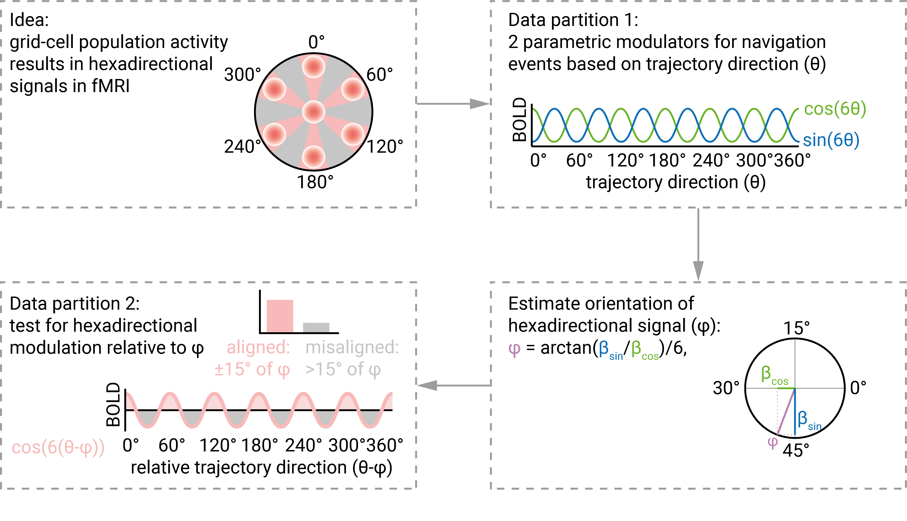

# Overview

Grid-like hexadirectional signals are thought of as a proxy-measure for the activity of grid cell populations ([Doeller et al., Nature, 2010](https://www.nature.com/articles/nature08704)). The goal of this project is to showcase the analysis pipeline to detect these hexadirectional signals using FSL and R.
  
  
{width=100%}
Visualization by Jacob Bellmund, licensed under [CC BY 4.0](https://creativecommons.org/licenses/by/4.0/).

>The main idea of the analysis is illustrated in the figure above. In brief, the characteristic six-fold symmetric firing patterns of grid cells might, on the population level, result in a six-fold (i.e. hexadirectional) modulation of activity that can be picked up with fMRI (top left). Thus, we will analyze fMRI data as a function of movement direction through a virtual environment in a spatial navigation task. However, the orientation (or phase) of the hexadirectional signal relative to the virtual environment is unknown. One partition of the data will be use to estimate the orientation of the hexadirectional signal. This is accomplished by implementing a GLM that models navigation events, so movement trajectories through the virtual environment. Crucially, it includes two parametric modulators for these events, which are defined by the sine and cosine of the direction of the trajectory in 60°-space. So these regressors search for activity peaks every 60° as a function of the trajectory direction (top right). The parameter estimates of the sine and the cosine regressor are then combined to estimate the orientation of an underlying hexadirectional signal in the first data partition (bottom right). This estimate is then validated on the second data partition, where we test whether BOLD activity is higher when the participant moves along directions that are close to the estimated orientation. This can be done in different ways: Either using a cosine regressor that tests for a parametric 60° modulation, so high activity when running at 0°, 60°, 120° and so on relative to the estimated orientation. A second way of testing this modulation would be to use a contrast between trajectories aligned (within 15°) of the estimated orientation and misaligned (between 15° and 30° from the estimated orientation.


Thus, the three major steps the code goes through are:  

- GLM 1: fit sine and cosine regressor at given periodicity for navigation trajectories
- Estimate orientation of the periodic signal
- GLM 2: test signal modulations as a function of trajectory direction relative to estimated orientation


## Requirements

The code requires [FSL](https://fsl.fmrib.ox.ac.uk/fsl/fslwiki) to be installed and to be accessible from R. Additional packages will be installed, see below. If you don't have FSL installed, you will have to do that first. See [here](https://fsl.fmrib.ox.ac.uk/fsl/fslwiki/FslInstallation) for detailed instructions.

The code will automatically download example data that is based on the [GridCAT analysis toolbox](https://www.nitrc.org/projects/gridcat) for Matlab ([Stangl et al., Frontiers in Neuroinformatics, 2017](https://www.frontiersin.org/articles/10.3389/fninf.2017.00047/full)). 

Overall, you will need around 11 GB of free disk space.

## Workflow

I have tested this analysis pipeline on Mac OS and Linux. Below are some basic usage instructions for scientists at the MPI CBS that might be helpful for others, too. See \@ref(running-the-analysis) for how to start the analysis once everything is configured.

### CBS iMac or Macbook

On our CBS iMacs and Macbooks FSL should be installed per default, though you might have to [configure FSL](https://fsl.fmrib.ox.ac.uk/fsl/fslwiki/FslInstallation/ShellSetup) when using it for the first time. Start RStudio from the terminal using ```open -na Rstudio```.

### Remote Linux

You can also run the pipeline via the CBS NoMachine Remote Linux service. When logged on to a remote Linux session, hop on a least-utilized latest-generation (-sL) compute server by typing ```getserver -sL``` in a fresh console window. I have checked that everything works when using the FSL version stored in ```/usr/share/fsl/5.0/bin/fsl```, so configure your ```.bash_profile``` file in ```hu_yourusername``` accordingly. You can open RStudio by typing ```R+ --version 3.6.1 rstudio``` (you can also try different R versions of course, but not tested).  For some reason, FSL does not work properly when using ```/usr/lib/fsl/5.0/fsl```, which is what you get if you type ```FSL --cluster``` to start the FSL environment on the server. This is an issue we might have to solve when we later want to parallelize the analysis.  

### Running the analysis

Once you are in RStudio, open the R project file called ```hexadirectional_signals.Rproj``` in the folder ```hexadirectional_signals_pipeline```. This will set your working directory to this folder. From here you can run the entire analysis when typing ```bookdown::render_book()``` in the RStudio console. Thus, the [bookdown package](https://bookdown.org/) needs to be installed prior to running the analysis via ```install.packages("bookdown")```. This command will install the package to the default library location.  

Other required packages (see next section) will be installed if necessary and loaded when rendering the book. If this fails, e.g. because user input is required, try running the section below manually once to make sure all packages are installed correctly.

## Required packages

We begin by loading the required packages (after installing them if necessary).


```{r required_packages}
if (!require(bookdown)){install.packages("bookdown"); library("bookdown")}
if (!require(tidyverse)){install.packages("tidyverse"); library("tidyverse")}
if (!require(here)){install.packages("here"); library("here")}
if (!require(fslr)){install.packages("fslr"); library("fslr")}
if (!require(oro.nifti)){install.packages("oro.nifti"); library("oro.nifti")}
if (!require(cowplot)){install.packages("cowplot"); library("cowplot")}
if (!require(useful)){install.packages("useful"); library("useful")}
if (!require(circular)){install.packages("circular"); library("circular")}
if (!require(remotes)){install.packages("remotes"); library("remotes")}
if (!require(grateful)){remotes::install_github("Pakillo/grateful"); library("grateful")}
#if (!require(tidylog)){install.packages("tidylog"); library("tidylog", warn.conflicts = FALSE)} # very helpful logs of dplyr functions, but too much output for now

```
